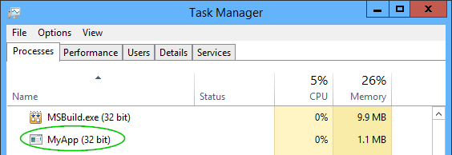
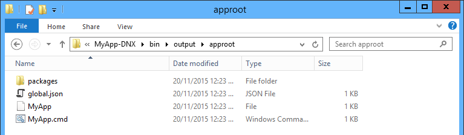
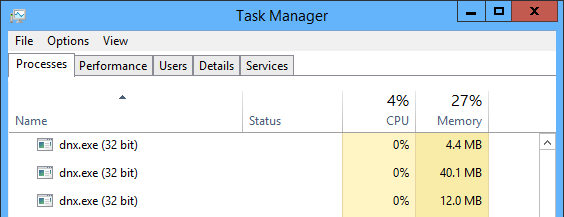
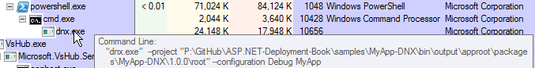

# Runtimes and Execution

To understand how ASP.NET 5.0 applications will run in production, it helps to first understand what .NET Core and DNX are. In this chapter, we'll take some time to understand them, and to understand some of the changes to how .NET applications run under DNX. 

## Runtimes: .NET Framework vs. .NET Core

When .NET Framework 4.0 shipped, it came bundled with Windows Server 2012, and as a 48MB MSI for older versions of Windows. The .NET Framework contains just about everything, from UI toolkits (WPF and Windows Forms), to communication libraries (WCF/HTTP), to web application stacks (ASP.NET Web Forms). Because the framework ships as one big package, it's difficult to tease components apart, to iterate on them, or to ever remove something from them. 

To combat this, and to take .NET cross platform, ".NET Core" was created. This is a new take on the CLR, which has been mercilessly factored into small assemblies that are available as packages on NuGet. It has a few benefits:

 - **Cross platform**  
 .NET Core is supported on Windows, Linux and OSX.
 - **Portable**  
 .NET Core can be packaged and deployed as part of your application; no global installation required. 
 - **Lightweight**  
 Only the packages you actually use are imported.  

A> ####Portability is a major production benefit
A> Remember when .NET 4.5 shipped, and you really wanted to use features of it, but since it was an in-place upgrade you had to wait for months for it to be tested against all of the enterprise's other applications before you could use it? 
A>
A> Under .NET Core, that problem disappears. Different teams can use different versions of .NET Core without any one affecting another. 

I believe that .NET Core is the future, and the only reason .NET Framework isn't obsolete is that it will simply take a long time for types to be made cross platform, tested and ported. As the surface area of .NET Core grows, third party packages will start to target .NET Core, and eventually it will have a big enough surface area to become the default choice for all applications. 

### ASP.NET 5.0 targets both

For this reason, ASP.NET 5.0 targets both the .NET Framework, and .NET Core. That is, you can make use of new features and architectural improvements in ASP.NET 5.0, but still use the regular desktop .NET runtime without being limited to the .NET Core surface area. 

When you sit down to build an ASP.NET 5.0 application, it's very unlikely that you'll target both .NET Core and .NET Framework. You'll make a choice:

| .NET Core                         | .NET Framework                             |
|-----------------------------------|--------------------------------------------|
| Cross platform                    | Windows only                               |
| Lightweight                       | Heavy                                      |
| Portable (bundle with your app)   | Global, admin install                      |
| Iterates quickly                  | Slow upgrade cycle                         |
| Small surface area for now        | Everything but the kitchen sink            |

Class libraries and some utility tools, however, will likely targetting both runtimes. So what's needed is some way to figure out what runtime to invoke when running an application. That's where DNX comes in. 

## Execution: DNX

Whether your application targets the full .NET Framework or just .NET Core, it can be executed with DNX. Think of DNX as a host for your .NET applications, much like the way `python.exe` hosts a Python script. It's easier to understand this by looking at what it does at the process level Take this simple C# console application:

```
using System;
using System.Threading;

namespace MyApp
{
    class Program
    {
        static void Main(string[] args)
        {
            Console.WriteLine("Hello, world!");
            Thread.Sleep(10000);
        }
    }
}
```

Before DNX, this code would get compiled into an `.exe` file. The top of the `.exe` file would contain a small bit of native code that would check the .NET runtime is installed globally, then load the runtime, and then the runtime would run the rest of the application. In task manager, you would see your executable as the top process:



Under DNX, this all changes. Firstly, I get to choose my runtime. Will this console application target the .NET Framework, .NET Core, or both? 

Secondly, in development, there is no compilation step - code is compiled on the fly with Roslyn, so you'll never see a `.dll` or `.exe` in the first place when you hit F5 locally. When you are ready to ship the application, though, you'll eventually compile it. You do this using the `dnu` tool:

```
dnu publish --no-source
```

Instead of creating a `.exe` as you might expect, the code is actually compiled into a `.dll` inside a directory structure. The directories contain the application bundled as a NuGet package, plus various JSON configuration files. At the root is a `.cmd` batch file which invokes the application:



The batch file invokes `DNX.exe` (the actual batch file is longer than this - snipped for brevity). This tool is called the DNX Application Host, and it takes care of running applications built for DNX:

```
IF "%DNX_PATH%" == "" (
  SET "DNX_PATH=dnx.exe"
)
@"%DNX_PATH%" --project "%~dp0packages\MyApp-DNX\1.0.0\root" --configuration Debug MyApp %*
```

The `MyApp` file without the extension is a shell script, so the same application can run on Linux (again, snipped):

```
exec "dnx" --project "$DIR/packages/MyApp-DNX/1.0.0/root" --configuration Debug MyApp "$@"
```

The trick that DNX uses is similar to how Java applications run. Java applications aren't compiled into an `.exe`, they just ship as a `.jar` file which is then loaded by the Java executable:

```
java.exe myapp.jar
```

Something you'll notice is that if you look in task manager, you won't see the name of your console app anywhere - just DNX. In fact I'm not even sure which one of these three DNX processes contains my application: 



A good way to figure that out is by using SysInternals Process Explorer: 



One of the great benefits of DNX is that if your application targets CoreCLR, the runtime can be distributed with your application. You can now see how this can work - since the CoreCLR includes DNX.exe, all you need to do is distribute the CoreCLR runtime files with your application, and your batch file will invoke that DNX version. You can bundle the runtime and have your batch file call that simply by specifying the option when publishing:

```
dnu publish --runtime active --no-source
```

A> ## Room for improvement? 
A> Personally, I think this folder structure is a bit messy and makes this seem more complicated than it should be. There's a good opportunity to hide all of these etails by keeping the shell script and batch file, but compressing the rest of the files into a NuGet package. `dnx myapp.1.0.0.nupkg` would be much neater. 

Now that you are familiar with how DNX invokes processes, let's look at two HTTP server options for ASP.NET 5.0. 

### Summary

.NET Core is an ambitious attempt to tease apart the monolithic .NET Framework into something that is portable, cross-platform and iterates quickly. DNX is a new way to build and run applications, whether they run on .NET Core *or* .NET Framework. We've looked at how DNX fits in with console applications; in the next chapter we'll look at how DNX executes ASP.NET applications. 
