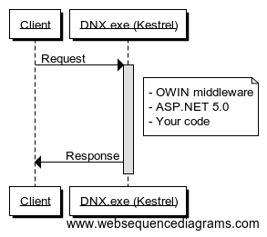

# Web Servers

Historically, there have been very few choices for deploying ASP.NET applications in production. ASP.NET was tightly coupled to IIS, which was tightly coupled to Windows, so the stack was chosen for you. As we discussed in chapter 1, ASP.NET 5.0 is about choice. 

Of course, IIS is still supported in ASP.NET 5.0. But since ASP.NET 5.0 builds on top of OWIN, any HTTP server that can host OWIN can host ASP.NET 5.0. And since .NET Core is cross-platform and IIS is not, we need new choices for HTTP servers when running ASP.NET 5 outside of Windows. 

In this chapter, we'll focus on the two HTTP servers that we expect will comprise of the majority of production ASP.NET 5.0 deployments: the new kid on the block, Kestrel, and the old, reliable IIS. 

## Kestrel

Kestrel is a cross-platform, open source HTTP server for ASP.NET 5.0. It's built by the same team at Microsoft that built ASP.NET 5.0, and it allows ASP.NET 5.0 applications to run consistently across Windows, Linux, and OSX. 

Where web servers like IIS and Apache are designed to be general-purpose web servers, with support for many languages and features like directory browsing and static content serving, Kestrel is designed specifically for hosting ASP.NET 5.0. Architectually, Kestrel builds on top of:

 - **`libuv`**, the open source asynchronous event library used by Node.js. This provides asynchronous TCP sockets to Kestrel in an OS-agnostic manner. 
 - **`SslStream`**, a .NET framework class to turn an ordinary stream into a TLS stream. This allows Kestrel to support HTTPS, including client-side certificates. On Windows, `SslStream` builds on `SChannel`, the standard Windows TLS components also used by IIS. In practical terms, this means that HTTPS with Kestrel is as secure as HTTPS with IIS. 

Kestrel is entirely user-mode and binds to a TCP port directly to listen for requests. Kestrel can be used to run your ASP.NET 5.0 application, or embedded inside your own process. This is handy when building long-running services that sometimes need to present a web interface. 

In addition to TCP, Kestrel can also listen on named pipes or UNIX pipes. At first this may seem strange, but it will make sense in a moment. 

## IIS

IIS is a general purpose web server which can also host ASP.NET 5.0. However, the way IIS hosts ASP.NET 5.0 is dramatically different than previous versions of IIS. Let's first look at the architecture of IIS and how ASP.NET was traditionally hosted, and how it now works with ASP.NET 5.0. 

### IIS Architecture

Windows ships with a kernel-mode device driver called HTTP.sys, which listens for HTTP connections and hands them over to an appropriate application. It allows multiple applications to effectively share the same IP/port combinations by performing some HTTP parsing in the kernel before dispatching to the application. For example: 

    http://server:80/app1   # hosted by IIS
    http://server:80/app2   # hosted by a different process

IIS builds on top of HTTP.sys - the request is initially received by HTTP.sys (which also performs some security filtering, like Windows Authentication or client certificates), which in turn hands it to IIS. It then sends the response from IIS back to the client. 

Each application running on IIS belongs to an application pool, and a worker process is created to serve requests to that application pool. This is the w3wp process you'll sometimes see in task manager. If the process runs for significant time, or experiences severe memory leaks and runs out of memory, or hangs, IIS can terminate it and create a new worker process. 

The application pools in IIS then have two different pipeline modes - the classic pipeline mode, which relies on unmanaged ISAPI modules to do the work, and the integrated pipeline mode, where the desktop CLR is loaded into IIS and .NET modules can be used to serve requests. 

### Changes in ASP.NET 5.0

As of ASP.NET 5.0, the integrated pipeline mode for application pools is obsolete. Instead, ASP.NET 5.0 under IIS actually uses Kestrel! 

The resulting architecture looks like this: 

Diagram showing IIS->W3WP.exe->DNX->Kestrel

Under ASP.NET 5.0:

 1. The client sends a request
 2. HTTP.sys intercepts the request, sends it to the WWW Service, which then sends it to an application pool worker process
 3. The worker process hosts a single, unmanaged module WHATEVER
 4. This module launches DNX, which hosts Kestrel
 5. The request is forwarded to Kestrel over named pipes
 6. Kestrel processes the request and returns the response back to the worker process
 7. The worker process returns the response to HTTP.sys

Just as the worker process runs for hours or days between being recycled, the DNX process hosting Kestrel is created when the worker process is created, and serves multiple requests. 

When I look at this diagram, I do wonder how relevant IIS will remain. In the Linux world, general purpose web servers like Apache seem to have been replaced by application-specific HTTP servers (Node.js processes for example) fronted by something like NGINX which simply proxies requests. IIS has effectively been reduced to this. The integrated pipeline is obsolete, and most of the modules in IIS will probably just become OWIN middleware. 

HTTPPlatformHandler
