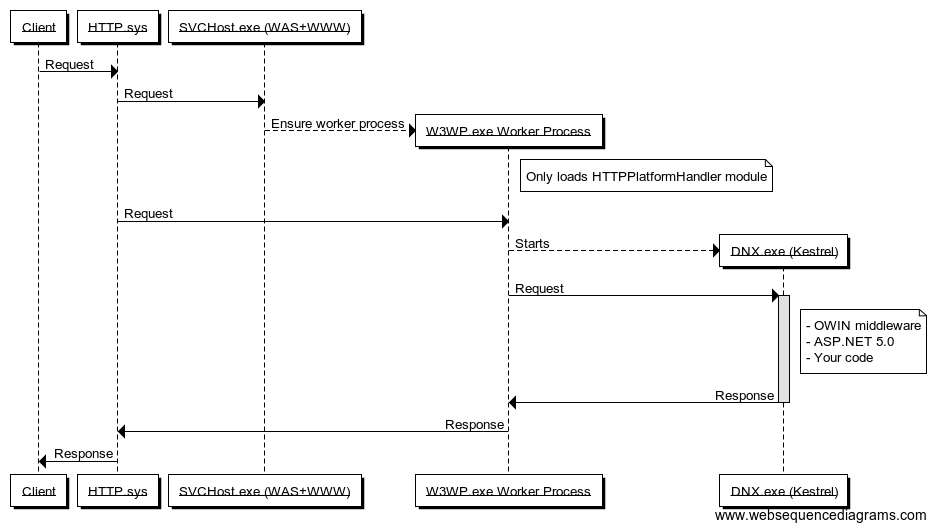
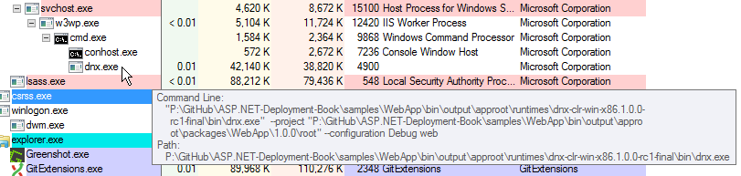
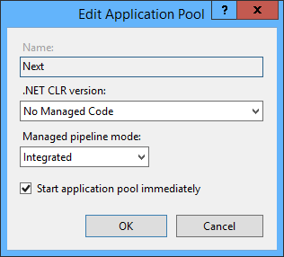
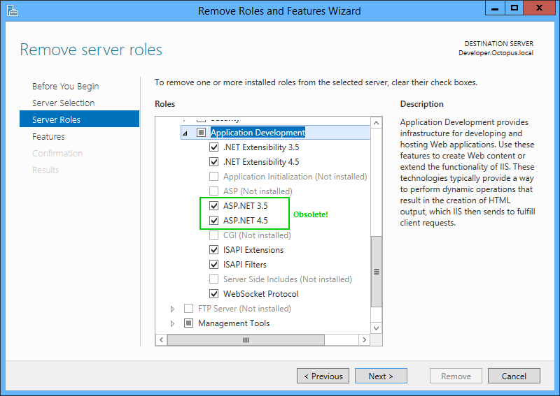

# Web Servers

Historically, there have been very few choices for deploying ASP.NET applications in production. ASP.NET was tightly coupled to IIS, which was tightly coupled to Windows, so the stack was chosen for you. As we discussed in chapter 1, ASP.NET 5.0 is about choice. 

Of course, IIS is still supported in ASP.NET 5.0. But since ASP.NET 5.0 builds on top of OWIN, any HTTP server that can host OWIN can host ASP.NET 5.0. And since .NET Core is cross-platform and IIS is not, we need new choices for HTTP servers when running ASP.NET 5 outside of Windows. 

In this chapter, we'll focus on the two HTTP servers that we expect will comprise of the majority of production ASP.NET 5.0 deployments: the new kid on the block, Kestrel, and the old, reliable IIS. 

## Kestrel

Kestrel is a cross-platform, open source HTTP server for ASP.NET 5.0. It's built by the same team at Microsoft that built ASP.NET 5.0, and it allows ASP.NET 5.0 applications to run consistently across Windows, Linux, and OSX. 

Where web servers like IIS and Apache are designed to be general-purpose web servers, with support for many languages and features like directory browsing and static content serving, Kestrel is designed specifically for hosting ASP.NET 5.0. Architectually, Kestrel builds on top of:

 - **`libuv`**, the open source asynchronous event library used by Node.js. This provides asynchronous TCP sockets to Kestrel in an OS-agnostic manner. 
 - **`SslStream`**, a .NET framework class to turn an ordinary stream into a TLS stream. This allows Kestrel to support HTTPS, including client-side certificates. On Windows, `SslStream` builds on `SChannel`, the standard Windows TLS components also used by IIS. In practical terms, this means that HTTPS with Kestrel is as secure as HTTPS with IIS. 

Kestrel is entirely user-mode and binds to a TCP port directly to listen for requests. Kestrel can be used to run your ASP.NET 5.0 application, or embedded inside your own process. This is handy when building long-running services that sometimes need to present a web interface. 

## IIS

IIS is a general purpose web server which can also host ASP.NET 5.0. However, the way IIS hosts ASP.NET 5.0 is dramatically different than previous versions of ASP.NET. Let's first look at the architecture of IIS and how ASP.NET was traditionally hosted, and how it now works with ASP.NET 5.0. 

### IIS Architecture

Windows ships with a kernel-mode device driver called HTTP.sys, which listens for HTTP connections and hands them over to an appropriate application. It allows multiple applications to effectively share the same IP/port combinations by performing some HTTP parsing in the kernel before dispatching to the application. For example: 

    http://server:80/app1   # hosted by IIS
    http://server:80/app2   # hosted by a different process

IIS builds on top of HTTP.sys - the request is initially received by HTTP.sys (which also performs some security filtering, like Windows Authentication or client certificates), which in turn hands it to IIS. It then sends the response from IIS back to the client. 

Each application running on IIS belongs to an application pool, and a worker process is created to serve requests to that application pool. This is the W3WP process you'll sometimes see in task manager. If the process runs for significant time, or experiences severe memory leaks and runs out of memory, or hangs, IIS can terminate it and create a new worker process. 

In previous versions of ASP.NET, the CLR was loaded into the worker process[^classic]. Under ASP.NET 5.0, this changes. 

[^classic]: In Integrated pipeline mode, IIS hosts the CLR and all IIS modules are managed modules. With Classic pipeline mode, IIS used unmanaged modules, and then the CLR ran its own unmanaged modules. 

 - The worker process no longer contains the CLR - it's entirely unmanaged
 - All requests are routed to a new, unmanaged extension called the [HTTP Platform Handler](https://azure.microsoft.com/en-us/blog/announcing-the-release-of-the-httpplatformhandler-module-for-iis-8/)
 - The HTTP Platform Handler launches a DNX process by invoking the batch files we saw in the section on DNX. It sets an environment variable to tell the launched process what port to listen on. 
 - DNX loads Kestrel! 
 - HTTP Platform Handler then proxies the request to Kestrel in the DNX process, and proxies the response back

Processing a request in IIS for ASP.NET 5 looks like this:

This architecture will be familar to users who have done development with platforms like Node.js, where it is common to have a server like NGINX accepting the initial request, then reverse proxying them to a node.exe process which listens on its own TCP port. 

Here's the process tree in SysInternals Process Explorer:

### IIS setup notes

Due to these major architectural changes, the way you set up and configure IIS for ASP.NET 5 changes quite a bit. 

First, you must download and install the [HTTP Platform Handler](http://www.iis.net/downloads/microsoft/httpplatformhandler) extension. Eventually I expect this will ship out of the box with IIS, but for now it's a separate download. 

Second, since application pool worker processes no longer host the CLR (since all they do is call an extension to run a batch file), you can configure them to not load it:

Third, if your IIS server isn't going to be running older versions of ASP.NET, you don't even need to install the ASP.NET IIS components at all! 

### Benefits of IIS

Given that IIS effectively just proxies requests to and from Kestrel, what value does it provide? The main benefit would appear to be worker process management: if the DNX process becomes unresponsive, IIS can terminate the worker process tree, and a new one will be created, keeping the application responsive. 

On the other hand, the responsibilities of IIS have been dramatically reduced to that of a process manager and reverse proxy server: a Microsoft equivalent of NGINX. It remains to be seen whether many .NET applications will run directly under Kestrel without IIS in the middle. 

TODO: I need to confirm how other managed modules still work in this model. The HTTP Platform Handler extension is added and accepts all requests, but it doesn't remove any other modules, so presumably the CLR is still loaded into the worker process to call some of the native IIS modules. 

## Summary

The hosting architecture of ASP.NET 5 is radically different to previous versions, and for good reasons. By decoupling ASP.NET from IIS, a lot of choice is available and the team can iterate much more quickly. And yet IIS is still supported, acting as a reverse proxy instead of a web server, borrowing from the model of other web stacks. And there's still a lot of consistency: whichever approach you use, it's will still be ASP.NET hosted in Kestrel/DNX. 

Now that you know how applications will run in production, the next chapter will look at publishing applications. 
