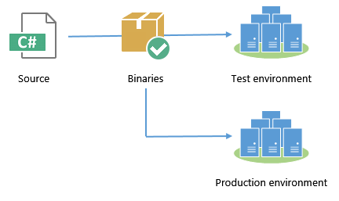

# Publishing Appliations for Deployment

In this chapter, we'll take a deep look into how to publish your ASP.NET 5 application so that you can deploy it for other people to use. We'll look at publishing with the `dnu` utility in detail, and discuss some of the options to consider when deciding how to publish. 

## Publishing with DNU

DNU is a command-line tool that is part of DNX, and contains a number of utilities for building, packaging and publishing applications. When you're past the "works on my machine" stage of development and you're ready to run the application on another server, `dnu` is your friend. 

Publish a DNX application by calling `dnu publish` from the project directory. Here's what I recommend: 

```
dnu publish --runtime active --no-source -o ..\published-webapp
```

The structure of a published web application looks like this:

 - **approot**  
   - **packages**   
   Any libraries from NuGet packages that you use will be copied to a directory structure under here. When you pass the `--no-source` option (more below) your own application is also compiled into a NuGet package under here.  
   - **runtimes**  
   The CLR runtime that you are using is copied here, with a folder per runtime. For .NET Core, this will be the full runtime - every file you need to run the application. For .NET Framework, it will just contain a few DNX-related assemblies and `DNX.exe`; it will rely on the full .NET Framework being installed globally. 
 - **logs**  
 By default this is an empty folder; you can enable logs manually. We'll cover this in a later section. 
 - **wwwroot**  
 This will contain a small web.config that is used only when hosting your application under IIS; it simply tells IIS to call the HTTP Platform Handler and let DNX take care of the rest. The folder will also contain any static files (CSS, JavaScript, images, etc.) that your application uses. 

Remember that DNX applications don't simply run - they have to be run by `DNX.exe`. `DNX.exe` must either be bundled with your application (which is why we pass `--runtime active`), or available on the PATH environment variable. As a developer, you have a version of DNX in your path already, but your production server won't. 

I> The active runtime is defined as a per-user environment variable. You can change the current runtime using `dnvm`, the .NET version manager. 

## To compile, or not to compile

I also pass the `--no-source` flag when publishing. This ensures that `dnu publish` compiles the code and only publishes the compiled output, not the source code. Without this argument, DNX will dynamically compile the application on the fly as it runs with Roslyn. The Roslyn dynamic compilation features of ASP.NET 5 were designed to make for a better development experience; there's really no benefit to using them in production. 

In addition, publishing source code always leaves the chance that subsequent compilations could result in slightly different behavior. This is especially true if you target the full .NET Framework, since it is installed globally and could vary between machines depending on patches. When I test code in a pre-production environment and promote it to production, I want to feel confident that what I deploy to production is as similar as possible to what I tested. Compiling the source code into assemblies as part of the publish step removes one more possible cause of production problems. 

## Publish once, deploy many times

If you have more than one target environment, or more than one target server, then you should develop the habit of publishing once, deploying many times. In other words, publish the project once, then use the same published outputs when promoting between environments:



