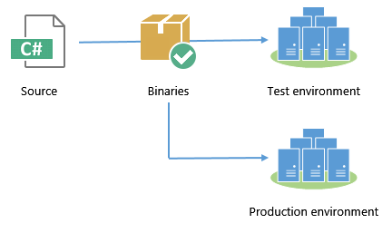

# Publishing Applications for Deployment

In this chapter, we'll take a deep look into how to publish your ASP.NET 5 application so that you can deploy it for other people to use. Rather than spend time on wizards in Visual Studio, we'll concentrate on using the command line to publish, so that we can automate it as part of our automated build and deployment process.  

Prior to ASP.NET 5, publishing applications from the command line was arcane and fiddly. The good news is that it gets much, much easier with the new `dnu` tool. 

## Publishing with DNU

DNU is a command-line tool that is part of DNX, and contains a number of utilities for building, packaging and publishing applications. When you're past the "works on my machine" stage of development and you're ready to run the application on another server, `dnu` is your friend. 

Publish a DNX application by calling `dnu publish` from the project directory. Here's what I recommend: 

```
dnu publish --runtime active --no-source -o ..\published-webapp --configuration Release
```

The structure of a published web application looks like this:

 - **approot**  
   - **packages**   
   Any libraries from NuGet packages that you use will be copied to a directory structure under here. When you pass the `--no-source` option (more below) your own application is also compiled into a NuGet package under here.  
   - **runtimes**  
   The CLR runtime that you are using is copied here, with a folder per runtime. For .NET Core, this will be the full runtime - every file you need to run the application. For .NET Framework, it will just contain a few DNX-related assemblies and `DNX.exe`; it will rely on the full .NET Framework being installed globally. 
 - **logs**  
 By default this is an empty folder; you can enable logs manually. We'll cover this in a later section. 
 - **wwwroot**  
 This will contain a small web.config that is used only when hosting your application under IIS; it simply tells IIS to call the HTTP Platform Handler and let DNX take care of the rest. The folder will also contain any static files (CSS, JavaScript, images, etc.) that your application uses. 

Remember that DNX applications don't simply run - they have to be run by `DNX.exe`. `DNX.exe` must either be bundled with your application (which is why we pass `--runtime active`), or available on the PATH environment variable. As a developer, you have a version of DNX in your path already, but your production server won't. 

I> #### Active runtime? 
I> The active runtime is defined as a per-user environment variable. You can change the current runtime using `dnvm`, the .NET version manager. It's worth keeping this in mind - sometimes your active runtime will be different to what you might expect. 

## To compile, or not to compile

I also pass the `--no-source` flag when publishing. This ensures that `dnu publish` compiles the code and only publishes the compiled output, not the source code. Without this argument, DNX will dynamically compile the application on the fly as it runs with Roslyn. The Roslyn dynamic compilation features of ASP.NET 5 were designed to make for a better development experience; there's really no benefit to using them in production. 

In addition, publishing source code always leaves the chance that subsequent compilations could result in slightly different behavior. This is especially true if you target the full .NET Framework, since it is installed globally and could vary between machines depending on patches. When I test code in a pre-production environment and promote it to production, I want to feel confident that what I deploy to production is as similar as possible to what I tested. Compiling the source code into assemblies as part of the publish step removes one more possible cause of production problems. 

## Publish once, deploy many times

If you have more than one target environment, or more than one target server, then you should develop the habit of publishing once, deploying many times. In other words, publish the project once, then use the same published outputs when promoting between environments:



## Running with Kestrel

Now that you have published your application, you can test that it runs. Running it under Kestrel is easy. Simply go to the `approot` folder of your published directory, and run the `web.cmd` batch script: 


This is made possible by the `commands` element inside your `project.json` file. The `dnu publish` tool takes any commands, and turns them into batch files. In my case, `project.json` contains:

```
{
  // snip for brevity...
  "dependencies": {
    "Microsoft.AspNet.Server.Kestrel": "1.0.0-rc1-final",
    // ...
  },

  "commands": {
    "web": "Microsoft.AspNet.Server.Kestrel"
  }
}
```

So the `web.cmd` file that `dnu publish` generates calls DNX over the Kestrel console application, as we saw in the first chapter. Kestrel then listens on a port and serves the application. 

## Running with IIS

The published output folder is also ready to be used by IIS. Simply point IIS at the `wwwroot` folder of the published output: 


T> #### Install HTTP Platform Handler
T> Remember that DNX on IIS [requires the HTTP Platform Handler extension](http://www.iis.net/downloads/microsoft/httpplatformhandler) to be installed.

This is made possible by the small `web.config` file inside `wwwroot`, which tells the worker process to dispatch all requests through the HTTP Platform Handler:

```
<configuration>
  <system.webServer>
    <handlers>
      <add name="httpplatformhandler" path="*" verb="*" modules="httpPlatformHandler" resourceType="Unspecified" />
    </handlers>
    <httpPlatform processPath="..\approot\web.cmd" arguments="" stdoutLogEnabled="false" stdoutLogFile="..\logs\stdout.log" startupTimeLimit="3600"></httpPlatform>
  </system.webServer>
</configuration>
```

Notice how the `processPath` attribute points back to the same `web.cmd` file that we called when we ran the app directly under Kestrel. 

## Logging

Whether you run your application directly under Kestrel or via IIS, DNX is still running as a console application. This means that you can capture log output from the console and send it to the `logs` folder that was created as part of the published output. Simply change the `stdoutLogEnabled` attribute in `web.config` to `true`. 

### Summary

In this chapter we explored `dnu publish`, a new standard way to prepare DNX applications for deployment. We reviewed some best practices like publish once, deploy many times, and saw how to run the application manually under Kestrel or IIS. 

In the next chapters we'll look at automating the publishing and deployment as part of a continuous delivery pipeline. 
